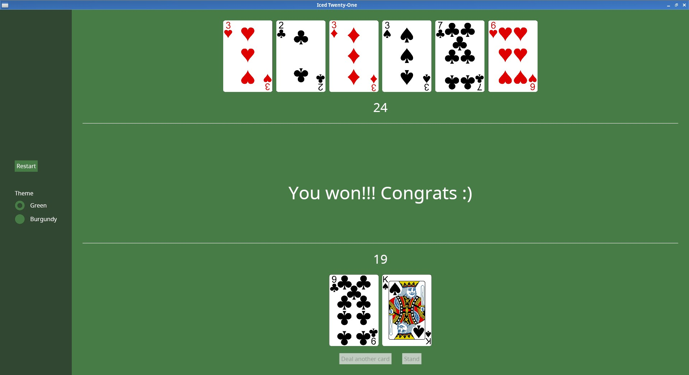

# Iced through an example: A Twenty-One game

A basic tutorial where you (hopefully) can learn a bit of [Iced](https://github.com/iced-rs/iced) while you follow the development of a simple example application.

I often enjoy those kind of tutorials where you create a simple project to learn things as you progress, and that's why I made this one, I hope it will be at least a little bit useful.

Try it here: https://brianch.github.io/iced-twentyone-tutorial/

It has a couple minor problems in how the commits were done, but you can check the tutorial code step by step in this repo: https://github.com/brianch/iced-twentyone
