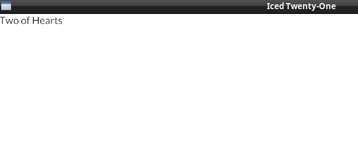

# Showing the Card as text

Now let's go back to our iced application, just for starters, let's replace the "Hello Iced" message with a random card.

For this, in our app state (our `IcedTwentyOne` struct) we will have two fields, a deck and our hand (the deck field not being used yet, but let's add it already).
```rust
mod card;
use card::{Deck, Hand};

struct IcedTwentyOne {
    deck: Deck,
    player_hand: Hand,
}
```
Now it's good to start implementing the `Default` trait ourselves, in our `Default` state we start the deck, suffle the cards, and draw one to our hand.
```rust
impl Default for IcedTwentyOne {
    fn default() -> IcedTwentyOne {
        let mut deck = Deck::new();
        let mut hand = Hand::new();
        deck.shuffle();
        hand.push(deck.deal_card().unwrap());
        IcedTwentyOne {
            deck: deck,
            player_hand: hand,
        }
    }
}
```

And now that the card is there, we can show it on our `view()`:

```rust
fn view(&self) -> Element<Self::Message> {
    let card = text(self.player_hand.cards[0]);
    container(card).into()
}
```

Each time you run the app, you should see a different Card, try it!
<br><br>

This is the full code as of now, it's only showing the things we changed, but you can click on the eye button to see the whole content.

```rust
#use iced::widget::{container, text};
#use iced::executor;
#use iced::{Application, Element, Settings, Theme, Command};

mod card;
use card::{Deck, Hand};

struct IcedTwentyOne {
    deck: Deck,
    player_hand: Hand,
}

impl Default for IcedTwentyOne {
    fn default() -> IcedTwentyOne {
        let mut deck = Deck::new();
        let mut hand = Hand::new();
        deck.shuffle();
        hand.push(deck.deal_card().unwrap());
        IcedTwentyOne {
            deck: deck,
            player_hand: hand,
        }
    }
}


# #[derive(Debug, Clone, Copy)]
#enum Message {
#}

impl Application for IcedTwentyOne {
#    type Executor = executor::Default;
#    type Flags = ();
#    type Message = Message;
#    type Theme = Theme;

#    fn new(_flags: ()) -> (IcedTwentyOne, Command<Self::Message>) {
#        (IcedTwentyOne::default(), Command::none())
#    }

#    fn title(&self) -> String {
#        String::from("Iced Twenty-One")
#    }

#    fn update(&mut self, _message: Self::Message) -> Command<Self::Message> {
#        Command::none()
#    }

    fn view(&self) -> Element<Self::Message> {
        let card = text(self.player_hand.cards[0]);
        container(card).into()
    }
}

#pub fn main() -> iced::Result {
#    IcedTwentyOne::run(Settings::default())
#}
```


