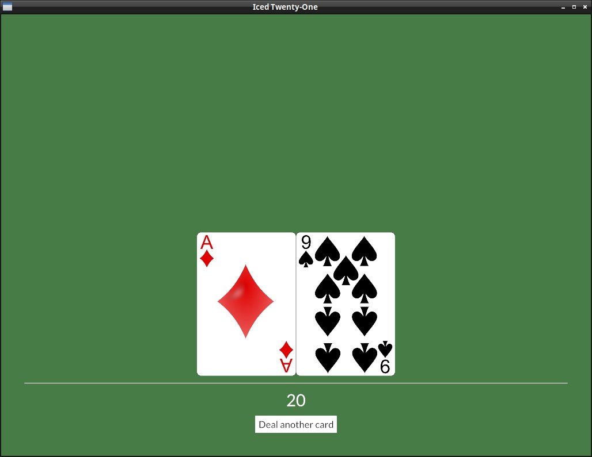

# A custom Theme

The visual is still a bit too generic, in most iced apps it will be a nice idea to implement a custom theme instead of using the default as we are right now, this might be a good chance to do it.

This will be a complex chapter, so don't feel discouraged if it take a while to understand things. It's honestly a bit cumbersome to implement, since we have to define a stylesheet for all the widgets we are using (even if we don't care that much about it). You could implement a custom stylesheet for a specific widget, but that isn't so intuitive either).

Anyway, to keep everything consistent, we'll opt to make our own new theme, doing this will also be instructive to understand how the theming works.
#### Important:
Iced themes are used to change colors, borders and such things, but **not** layout related stuff (padding, spacing, alignment, etc.).

## How it works:

For each iced widget, there's a different `StyleSheet` trait with rules about it's styling. Those traits return an `Appearance` struct (which is different for each widget). This is the trait signature of the [`iced::widget::button::StyleSheet`](https://docs.rs/iced/latest/iced/widget/button/trait.StyleSheet.html) for example:
```rust
pub trait StyleSheet {
    type Style: Default;

    // Required method
    fn active(&self, style: &Self::Style) -> Appearance;

    // Provided methods
    fn hovered(&self, style: &Self::Style) -> Appearance { ... }
    fn pressed(&self, style: &Self::Style) -> Appearance { ... }
    fn disabled(&self, style: &Self::Style) -> Appearance { ... }
}
```
(Appearance is an `iced::widget::button::Appearance`)

What we need to do is make an enum representing our new `Theme`, and implement these stylesheet traits for the widgets we use on our app, the structure will look like this:
```rust
#[derive(Debug, Clone, Copy, PartialEq, Eq, Default)]
pub enum OurTheme {
    #[default]
    DefaultVariant, //We can have many, for example to have Dark and Light variants
}

impl application::StyleSheet for OurTheme {
    type Style = ();

    fn appearance(&self, _style: &Self::Style) -> application::Appearance { ... }
}

impl button::StyleSheet for OurTheme {
    type Style = ();
    fn active(&self, _style: &Self::Style) -> button::Appearance { ... }}
    fn hovered(&self, _style: &Self::Style) -> button::Appearance { ... }}
    fn pressed(&self, _style: &Self::Style) -> button::Appearance { ... }}
}

impl container::StyleSheet for OurTheme {
    type Style = ();
    fn appearance(&self, _style: &Self::Style) -> container::Appearance { ... }}
}
...
```
<br><br>

But let's get back to the actual code, this here will be our starting point, save it as theme.rs:
```rust
use iced::widget::{button, container, text, rule};
use iced::{application, Color, color};

#[derive(Debug, Clone, Copy, PartialEq, Eq, Default)]
pub enum TwentyOneTheme {
    #[default]
    Green,
}

impl application::StyleSheet for TwentyOneTheme {
    type Style = ();

    fn appearance(&self, _style: &Self::Style) -> application::Appearance {
        application::Appearance {
            background_color: color!(0x477c47),
            text_color: Color::BLACK,
        }
    }
}

impl button::StyleSheet for TwentyOneTheme {
    type Style = ();

    fn active(&self, _style: &Self::Style) -> button::Appearance {
        button::Appearance {
            background: Some(iced::Background::Color(color!(0xFFFFFF))),
            text_color: Color::BLACK,
            ..Default::default()
        }
    }
    fn hovered(&self, _style: &Self::Style) -> button::Appearance {
        button::Appearance {
            background: Some(iced::Background::Color(color!(0x324731))),
            text_color: Color::WHITE,
            ..Default::default()
        }
    }
    fn pressed(&self, _style: &Self::Style) -> button::Appearance {
        self.hovered(_style)
    }
}

impl container::StyleSheet for TwentyOneTheme {
    type Style = ();

    fn appearance(&self, _style: &Self::Style) -> container::Appearance {
        container::Appearance {
                text_color: Some(Color::WHITE),
                ..Default::default()
        }
    }
}

impl text::StyleSheet for TwentyOneTheme {
    type Style = ();

    fn appearance(&self, _style: Self::Style) -> text::Appearance {
        text::Appearance::default()
    }
}

impl rule::StyleSheet for TwentyOneTheme {
    type Style = ();

    fn appearance(&self, _style: &Self::Style) -> rule::Appearance {
        rule::Appearance {
            color: Color::WHITE,
            width: 1,
            radius: 0.0,
            fill_mode: rule::FillMode::Full,
        }
    }
}
```

I know, I know, it's quite verbose, but on the bright side, it's not too hard to understand and you generally can copy the default Theme stylesheets [from iced](https://github.com/iced-rs/iced/blob/master/style/src/theme.rs) or examples like this one and just change the values you are interested in.

A few comments on the theme code:
- Our BlackjackTheme has a default (and currently, only) green variant, we will create more variants later.
- A few widgets' `Appearance` struct don't impl `Default`, here for example we had to define every field of the `Rule`, even though we didn't care much about them. This will probably change in the future.
- The point of the `Style` Type inside each `StyleSheet` is that we may have a few different styles, e.g. if we had a *"TableStyle"* and a *"MenuStyle"* for the buttons, in our `view()` we could just pass the style we want with `.style(theme::ButtonStyle)`. [Later](./19new_button_style.md) we will try this!

A few more tips about this:
- Using an IDE is a big help, you can press `Ctrl+Space` on VS Code while creating each `Appearance` struct to see the fields available and play with them.
- Pay attention to the documentation text, it's short but very helpful.
- Some stylesheet (like the `picklist` one) are more complicated and demand other elements, you can take a look at the default iced theme to check how it does things.
<br><br>

To use this Theme we need a couple changes to our `Application`, we obviously replace the `Theme` type with our own.

```rust
mod theme;

...

impl Application for IcedTwentyOne {
    type Executor = executor::Default;
    type Flags = ();
    type Message = Message;
    type Theme = theme::TwentyOneTheme;
```

But in our view arguments we also need to specify that we're using it and not iced's default:

```rust
fn view(&self) -> Element<Message, iced::Renderer<theme::TwentyOneTheme>> {
```

Don't worry about the `iced::Renderer` part, you don't need to deal with the renderer yourself, it's just that we needed to change the generic it uses.


