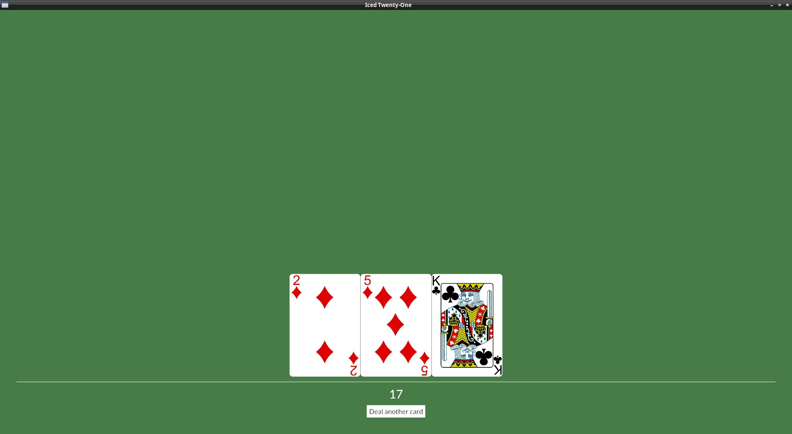

# Maximizing & Window modes

After the marathon of the last chapter, let's do something simple.

To start adding the game logic, it'll be nice to have more screen space to work with, so let's start the window maximized, we just need to pass `iced::window::maximize(true)` on our `new()`:

```rust
fn new(_flags: ()) -> (IcedTwentyOne, Command<Self::Message>) {
    (IcedTwentyOne::default(), iced::window::maximize(true))
}
```

Talking about `iced::window`, we can take a look at how to to make the program fullscreen, it's quite similar:

```rust
fn new(_flags: ()) -> (IcedTwentyOne, Command<Self::Message>) {
    (IcedBlackjack::default(), iced::window::change_mode(iced::window::Mode::Fullscreen))
}
```

We're using the `new()` function, but what if we wanted to change these things after the app is running? Notice that the `update()` function returns a `Command<Self::Message>`, just like the 2nd item in the tuple we return in `new()`, so we can just do the same there, you can try it out now if you want.

Take a look at the documentation of [`iced::Window`](https://docs.rs/iced/latest/iced/window/) if you want to learn more.


