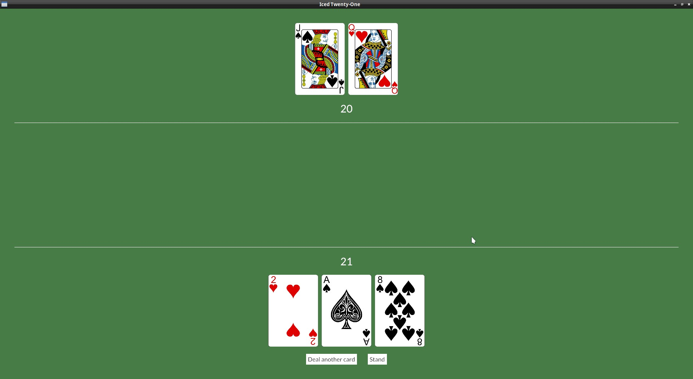

# Stand

We can't keep getting cards forever, we need to have a button to stand when we are happy with our hand. For now we can show the dealer's face down down card when we do that.

Let's include this part of the game in our GameStage enum:

```rust
#[derive(PartialEq)]
enum GameStage {
    Init, Dealing, Standing
}
```

Add the Message to be send when when we click on "Stand":

```rust
#[derive(Debug, Clone, Copy)]
enum Message {
    Start,
    DealCard,
    Stand,
}
```

Include the button in the `Column` we create when dealing (it would be nice for the buttons to be side by side, so add them to a `Row`) :

```rust
col![
    Rule::horizontal(4.),
    text(self.player_hand.value().to_string()).size(35),
    player_row,
    row![
        button(text("Deal another card")).on_press(Message::DealCard),
        button(text("Stand")).on_press(Message::Stand),
    ].spacing(30),
].width(Length::Fill).align_items(iced::Alignment::Center).spacing(20)
```

Let's add the Message processing to our `update()`:

```rust
fn update(&mut self, message: Self::Message) -> Command<Self::Message> {
    match message {
        Message::DealCard => {
            if let Some(new_card) = self.deck.deal_card() {
                self.player_hand.push(new_card);
            }
        } Message::Start => {
            self.game_stage = GameStage::Dealing;
        } Message::Stand => {
            self.game_stage = GameStage::Standing;
        }
    }
    Command::none()
}
```

Now that we know when to show the dealer's card, we can just add it to our `view()`, we need to remember to show their hand value too, so we separate this in a variable and pass that to iced's `text()` function later:

```rust
let mut dealer_hand_val = String::from("?");
let mut dealer_row = Row::new().spacing(10);
if self.game_stage == GameStage::Init || self.game_stage == GameStage::Dealing {
    dealer_row = dealer_row
        .push(image(String::from("img/") + &self.dealer_hand.cards[0].get_id() + ".png").height(Length::Fixed(200.)))
        .push(image(String::from("img/back.png")).height(Length::Fixed(200.)));
} else {
    for card in &self.dealer_hand.cards {
        dealer_row = dealer_row.push(image(String::from("img/") + &card.get_id() + ".png").height(Length::Fixed(200.)));
    }
    dealer_hand_val = self.dealer_hand.value().to_string();
};

let dealer_info = container(
    col![
        dealer_row,
        text(dealer_hand_val).size(35),
        Rule::horizontal(4.),
    ].width(Length::Fill).align_items(iced::Alignment::Center).spacing(20)
).height(Length::Fill).align_y(Vertical::Top);
```


