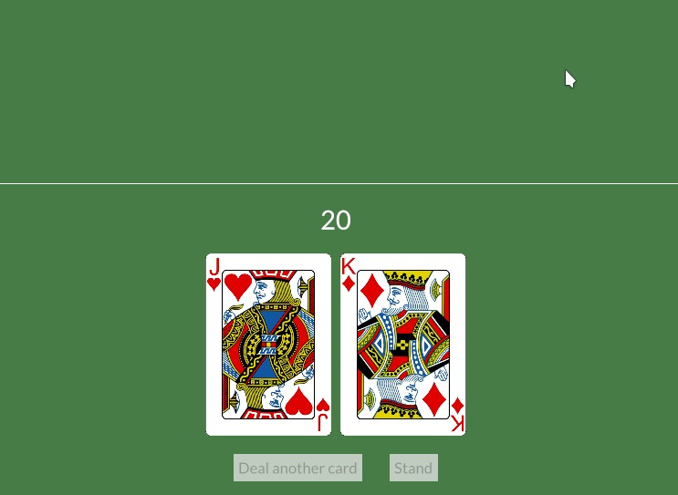

# Disable "deal card" button

If we stand, we shouldn't be able to get more cards, do you remember how to disable a button?

Similar to what we did before, in our `player_info_col` definition, in our else clause, let's start our row of buttons in a separate variable and include it in the `Column` later (click on the eye icon to see a few more lines for context if you want):

```rust
#let player_info_col = if self.game_stage == GameStage::Init {
#    col![
#        Rule::horizontal(4.),
#        text("?").size(35),
#        row![
#            image(String::from("img/") + &self.player_hand.cards[0].get_id() + ".png").height(Length::Fixed(200.)),
#            image(String::from("img/back.png")).height(Length::Fixed(200.)),
#        ].spacing(10),
#        button(text("Start Game")).on_press(Message::Start),
#    ].width(Length::Fill).align_items(iced::Alignment::Center).spacing(20)
} else {
    let btn_row = if self.game_stage == GameStage::Dealing {
        row![
            button(text("Deal another card")).on_press(Message::DealCard),
            button(text("Stand")).on_press(Message::Stand),
        ].spacing(30)
    } else {
        row![
            button(text("Deal another card")),
            button(text("Stand")),
        ].spacing(30)
    };
    let mut player_row = Row::new().spacing(10);
    for card in &self.player_hand.cards {
        player_row = player_row.push(image(String::from("img/") + &card.get_id() + ".png").height(Length::Fixed(200.)));
    }
    col![
        Rule::horizontal(4.),
        text(self.player_hand.value().to_string()).size(35),
        player_row,
        btn_row,
    ].width(Length::Fill).align_items(iced::Alignment::Center).spacing(20)
};
```


