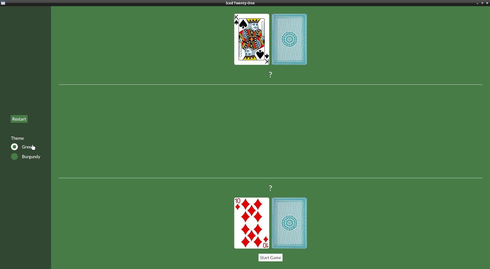

# Radio button: Theme switcher

We obviously need an in-game way to switch which theme we want, let's use radio buttons for this.

First of all, in our app state we need to have the theme info, we need to wrap it in an `Option` to use it with the `Radio` widget:

```rust
struct IcedTwentyOne {
    color_theme: Option<theme::TwentyOneTheme>,
```
And in the `default()`:
```rust
impl Default for IcedTwentyOne {
    fn default() -> IcedTwentyOne {
        let mut deck = Deck::new();
        let mut player = Hand::new();
        let mut dealer = Hand::new();
        deck.shuffle();
        player.push(deck.deal_card().unwrap());
        player.push(deck.deal_card().unwrap());
        dealer.push(deck.deal_card().unwrap());
        dealer.push(deck.deal_card().unwrap());

        IcedTwentyOne {
            color_theme: Some(theme::TwentyOneTheme::default()),
```

In our `view()` we can add the Radio buttons, our menu_col will look like this:

```rust
let menu_col = col![
    container(
        col![
            button(text("Restart")).on_press(Message::Restart).style(theme::ButtonStyle::Menu),
            Space::with_height(Length::Fixed(30.)),
            text("Theme"),
            Radio::new(theme::TwentyOneTheme::Green, "Green", self.color_theme, Message::ChangeTheme),
            Radio::new(theme::TwentyOneTheme::Burgundy, "Burgundy", self.color_theme, Message::ChangeTheme),
        ].spacing(10),
    ).height(Length::Fill).center_y().width(Length::Fill).center_x().style(theme::ContainerStyle::Menu)
].align_items(iced::Alignment::Center).spacing(10).width(Length::Fixed(200.));
```

Notice also the `Space` widget, it's a widget used just to add empty space between things.

The [`Radio::new()`](https://docs.rs/iced_native/latest/iced_native/widget/radio/struct.Radio.html#method.new) function takes four arguments:
- The value
- The label
- The current selected value
- The Message it should generate (or a function that generates a `Message`)

And now include the "ChangeTheme" Message, which will return us the new theme:

```rust
#[derive(Debug, Clone, Copy)]
enum Message {
    Start,
    DealCard,
    Stand,
    DealerDraw(Instant),
    Restart,
    ChangeTheme(theme::TwentyOneTheme),
}
```

On our `update()` we just need to set the state to the new value:

```rust
} Message::ChangeTheme(theme) => {
    self.color_theme = Some(theme);
}
```

We also need to start using a custom `theme()` function in our application:
```rust
fn theme(&self) -> Self::Theme {
    self.color_theme.unwrap()
}
```

But remember that on our theme we need to have a StyleSheet for all the widgets we're using, so we need to implement the trait `radio::StyleSheet` to our `theme.rs` too:
```rust
impl radio::StyleSheet for TwentyOneTheme {
    type Style = ();

    fn active(&self, _style: &Self::Style, _is_selected: bool) -> radio::Appearance {
        radio::Appearance {
            background: iced::Background::Color(self.palette().primary),
            dot_color: self.palette().secondary,
            border_width: 0.5,
            border_color: Color::TRANSPARENT,
            text_color: Some(self.palette().text_light),
        }
    }

    fn hovered(&self, _style: &Self::Style, _is_selected: bool) -> radio::Appearance {
        radio::Appearance {
            background: iced::Background::Color(self.palette().tertiary),
            dot_color: self.palette().primary,
            border_width: 0.5,
            border_color: Color::TRANSPARENT,
            text_color: Some(self.palette().text_light),
        }
    }
}
```


