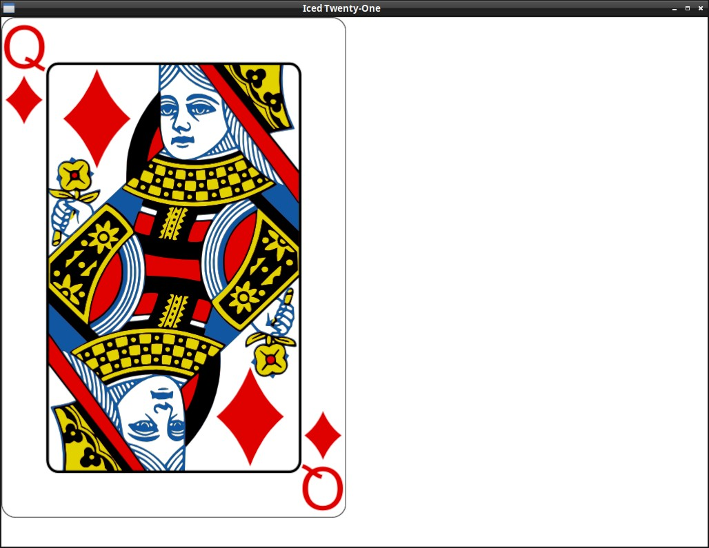

# Showing a card as image

By now your eyes are probably hurting a bit with how ugly the interface looks, so, before we continue, let's draw some nice images instead of just writing the card info.

We will use the card images from [this project](https://code.google.com/archive/p/vector-playing-cards/), just renamed to our needs. Download the "img" folder [from here](https://www.dropbox.com/s/n69r7nlo3oy6069/img.zip?dl=1) and extract it to your project's directory.
<br><br>

To show images in iced you need to use the iced feature `image` (or the feature `svg` if the images are svgs). Add it now to your Cargo.toml:

```sh
[dependencies]
iced = {version = "0.8.0", features = ["image"] }
rand = "0.8.4"
```

In the code we just need to import the `image` function instead of the `text` one:

```rust
use iced::widget::{container, image};
```

And pass the image file location to the function `image`, which will return our `Image` widget (or you can use `Image::new()`, the function is just a shorthand for it):

```rust
fn view(&self) -> Element<Self::Message> {
    let card = image(String::from("img/") + &self.player_hand.cards[0].get_id() + ".png");
    container(card).into()
}
```


