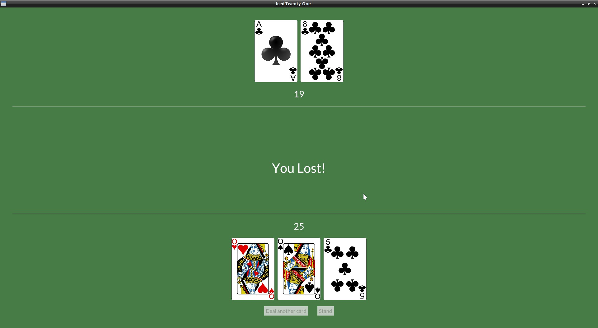

# Checking for result when dealing player's cards

It's finally time to start checking for the game result, we'll start to check for bursts or 21 after we draw a card to the player.

Let's include the possible results to our game_stage enum:

```rust
#[derive(PartialEq)]
enum GameStage {
    Init, Dealing, Standing, PlayerWon, HouseWon, Tie
}
```

And set this accordingly in our `update()`:
```rust
Message::DealCard => {
    if let Some(new_card) = self.deck.deal_card() {
        self.player_hand.push(new_card);
        if self.player_hand.value() == 21 {
            if self.dealer_hand.value() == 21 {
                self.game_stage = GameStage::Tie;
            } else {
                self.game_stage = GameStage::PlayerWon;
            }
        } else if self.player_hand.value() > 21 {
            self.game_stage = GameStage::HouseWon;
        }
    }
```

Now, in our view we can create a `Text` widget that will show the result:

```rust
fn view(&self) -> Element<Message, iced::Renderer<theme::TwentyOneTheme>> {

    let mut dealer_hand_val = String::from("?");
    let mut dealer_row = Row::new().spacing(10);
    let mut game_result = text("");
    if self.game_stage == GameStage::Init || self.game_stage == GameStage::Dealing {
        dealer_row = dealer_row
            .push(image(String::from("img/") + &self.dealer_hand.cards[0].get_id() + ".png").height(Length::Fixed(200.)))
            .push(image(String::from("img/back.png")).height(Length::Fixed(200.)));
    } else {
        if self.game_stage == GameStage::PlayerWon {
            game_result = text("You won!!! Congrats :)").size(50);
        } else if self.game_stage == GameStage::HouseWon {
            game_result = text("You Lost!").size(50);
        } else if self.game_stage == GameStage::Tie {
            game_result = text("It's a tie!!").size(50);
        }
#        for card in &self.dealer_hand.cards {
#            dealer_row = dealer_row.push(image(String::from("img/") + &card.get_id() + ".png").height(Length::Fixed(200.)));
#        }
#        dealer_hand_val = self.dealer_hand.value().to_string();
#    };
```

With the `Text` ready, we can just add it to our table_col:

```rust
let table_col = col![
    dealer_info,
    game_result,
    player_info,
].align_items(iced::Alignment::Center).spacing(10);
```


