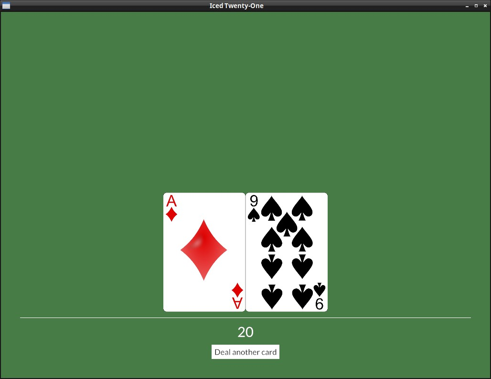

# A full custom Theme

What we saw so far was already quite useful, but if we want to have full flexibility in our app's appearance, we need to create our own custom theme, this is a bit complex, so don't feel discouraged if it take a while to understand things. The most cumbersome thing in this is that since we are creating a complete different theme, we will need to specify a stylesheet for every widget we use in our app (each one is just like the stylesheet we made for our button in the styling chapter).

#### Important:
Iced themes are used to change colors, borders and such things, but **not** layout related stuff (padding, spacing, alignment, etc.).

## How it works:

As we saw in [Chapter 5](./styling.md), for each iced widget, there's a different `StyleSheet` trait with rules about it's styling. Those traits return an `Appearance` struct (which is different for each widget). This is the trait signature of the [`iced::widget::button::StyleSheet`](https://docs.rs/iced/latest/iced/widget/button/trait.StyleSheet.html) as you may remember from that chapter:
```rust
pub trait StyleSheet {
    type Style: Default;

    // Required method
    fn active(&self, style: &Self::Style) -> Appearance;

    // Provided methods
    fn hovered(&self, style: &Self::Style) -> Appearance { ... }
    fn pressed(&self, style: &Self::Style) -> Appearance { ... }
    fn disabled(&self, style: &Self::Style) -> Appearance { ... }
}
```
(Appearance is an `iced::widget::button::Appearance`)

What we need to do is make an enum representing our new `Theme`, and implement these stylesheet traits for the widgets we use on our app, the structure will look like this:
```rust
#[derive(Debug, Clone, Copy, PartialEq, Eq, Default)]
pub enum OurTheme {
    #[default]
    DefaultVariant, //We can have many, for example to have Dark and Light variants
}

impl application::StyleSheet for OurTheme {
    type Style = ();

    fn appearance(&self, _style: &Self::Style) -> application::Appearance { ... }
}

impl button::StyleSheet for OurTheme {
    type Style = ();
    fn active(&self, _style: &Self::Style) -> button::Appearance { ... }}
    fn hovered(&self, _style: &Self::Style) -> button::Appearance { ... }}
    fn pressed(&self, _style: &Self::Style) -> button::Appearance { ... }}
}

impl container::StyleSheet for OurTheme {
    type Style = ();
    fn appearance(&self, _style: &Self::Style) -> container::Appearance { ... }}
}
...
```
<br><br>

But let's get back to the actual code, this here will be our starting point, save it as theme.rs:
```rust
use iced::widget::{button, container, text, rule};
use iced::{application, Color, color};

#[derive(Debug, Clone, Copy, PartialEq, Eq, Default)]
pub enum TwentyOneTheme {
    #[default]
    Green,
}

impl application::StyleSheet for TwentyOneTheme {
    type Style = ();

    fn appearance(&self, _style: &Self::Style) -> application::Appearance {
        application::Appearance {
            background_color: color!(0x477c47),
            text_color: Color::BLACK,
        }
    }
}

impl button::StyleSheet for TwentyOneTheme {
    type Style = ();

    fn active(&self, _style: &Self::Style) -> button::Appearance {
        button::Appearance {
            background: Some(iced::Background::Color(color!(0xFFFFFF))),
            text_color: Color::BLACK,
            ..Default::default()
        }
    }
    fn hovered(&self, _style: &Self::Style) -> button::Appearance {
        button::Appearance {
            background: Some(iced::Background::Color(color!(0x324731))),
            text_color: Color::WHITE,
            ..Default::default()
        }
    }
    fn pressed(&self, _style: &Self::Style) -> button::Appearance {
        self.hovered(_style)
    }
}

impl container::StyleSheet for TwentyOneTheme {
    type Style = ();

    fn appearance(&self, _style: &Self::Style) -> container::Appearance {
        container::Appearance {
                text_color: Some(Color::WHITE),
                ..Default::default()
        }
    }
}

impl text::StyleSheet for TwentyOneTheme {
    type Style = ();

    fn appearance(&self, _style: Self::Style) -> text::Appearance {
        text::Appearance::default()
    }
}

impl rule::StyleSheet for TwentyOneTheme {
    type Style = ();

    fn appearance(&self, _style: &Self::Style) -> rule::Appearance {
        rule::Appearance {
            color: Color::WHITE,
            width: 1,
            radius: 0.0.into(),
            fill_mode: rule::FillMode::Full,
        }
    }
}
```

I know, I know, it's quite verbose, but on the bright side, it's not too hard to understand and you generally can copy the default Theme stylesheets [from iced](https://github.com/iced-rs/iced/blob/master/style/src/theme.rs) or examples like this one and just change the values you are interested in.

A few comments on the theme code:
- Our TwentyOneTheme has a default (and currently, only) green variant, we will create more variants later.
- A few widgets' `Appearance` struct don't impl `Default`, here for example we had to define every field of the `Rule`, even though we didn't care much about them. This will probably change in the future.
- As we saw on chapter 5, the point of the `Style` Type inside each `StyleSheet` is that we may have a few different styles, e.g. if we had a *"TableStyle"* and a *"MenuStyle"* for the buttons, in our `view()` we could just pass the style we want with `.style(theme::ButtonStyle)`. [Later](./19new_button_style.md) we will try this!

A few more tips about this:
- Using an IDE is a big help, you can press `Ctrl+Space` on VS Code while creating each `Appearance` struct to see the fields available and play with them.
- Pay attention to the documentation text, it's short but very helpful.
- Some stylesheet (like the `picklist` one) are more complicated and demand other elements, you can take a look at the default iced theme to check how it does things.
<br><br>

To use this Theme we need a couple changes to our `Application`, but first delete the custom button style we created before (and the `.style()` call), we will do everything on our custom theme from now on. The first change is that we obviously replace the `Theme` type with our own.

```rust
mod theme;

...

impl Application for IcedTwentyOne {
    type Executor = executor::Default;
    type Flags = ();
    type Message = Message;
    type Theme = theme::TwentyOneTheme;
```

But in our view arguments we also need to specify that we're using it and not iced's default:

```rust
fn view(&self) -> Element<Message, iced::Renderer<theme::TwentyOneTheme>> {
```

Don't worry about the `iced::Renderer` part, you don't need to deal with the renderer yourself, it's just that we needed to change the generic it uses.


