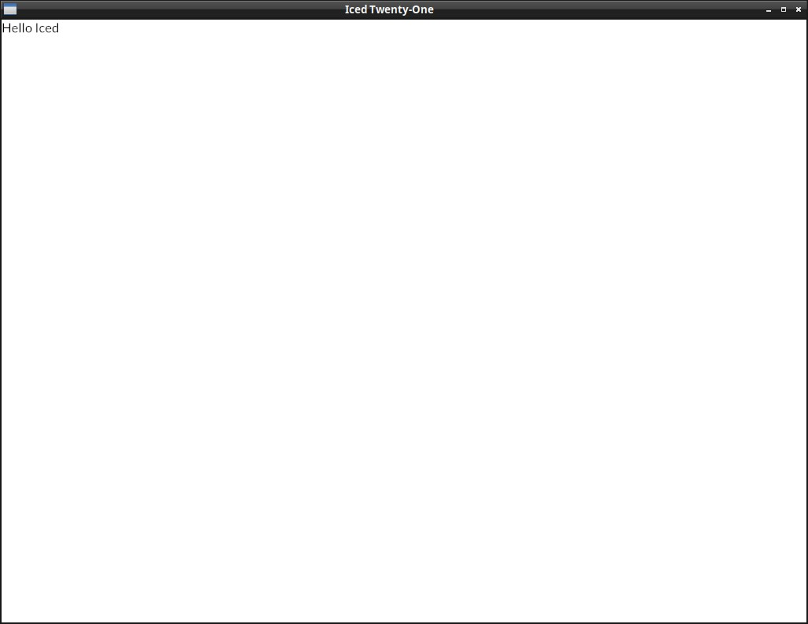

# Hello World

Let's start by creating the project:
```sh
$ cargo new iced-twentyone
```

Enter in this directory and, in your Cargo.toml, add the iced dependency:
```sh
[dependencies]
iced = "0.10.0"
```
This is the code for a minimal Hello World example, write it in your src/main.rs:

```rust
use iced::widget::{container, text};
use iced::{Sandbox, Element, Settings};

#[derive(Default)]
struct IcedTwentyOne;

#[derive(Debug, Clone, Copy)]
enum Message {
}

impl Sandbox for IcedTwentyOne {
    type Message = Message;

    fn new() -> Self {
        Self::default()
    }

    fn title(&self) -> String {
        String::from("Iced Twenty-One")
    }

    fn update(&mut self, message: Message) {
    }

    fn view(&self) -> Element<Message> {
        let hello = text("Hello Iced");
        container(hello).into()
    }
}

pub fn main() -> iced::Result {
    IcedTwentyOne::run(Settings::default())
}
```
-----------

## Let's look into it part by part:
```rust
#[derive(Default)]
struct IcedTwentyOne;

#[derive(Debug, Clone, Copy)]
enum Message {
}
impl Sandbox for IcedTwentyOne {
```

Our app `IcedTwentyOne` has to implement the [traits](https://doc.rust-lang.org/book/ch10-02-traits.html) [Sandbox](https://docs.rs/iced/latest/iced/trait.Sandbox.html) or [Application](https://docs.rs/iced/latest/iced/application/trait.Application.html) (Sandbox is a bit simpler and Application has a few more features, like using async and receiving initialization flags).

In Iced, a `message` represents a user interaction or some other relevant event (a click, selecting an item of a list, receiving updates from an async function, etc.). Our Message enum is still empty because there's no interaction at all in this hello world example.

```rust
fn update(&mut self, message: Message) {
}
```

The update function is where we will receive and process the messages of our application (those button clicks, radio button selections, drop down list selections, etc), but currently there's no message to process.

```rust
fn view(&self) -> Element<Message> {
    let hello = text("Hello Iced");
    container(hello).into()
}
```

The `view` function is where we define the layout of the app, in this case we have a [`Text`](https://docs.rs/iced_native/latest/iced_native/widget/text/struct.Text.html) widget with `"Hello Iced"`, which we put inside a `container` widget and call `.into()` to convert it into an `Element` (in general you don't need to worry about this last part)


