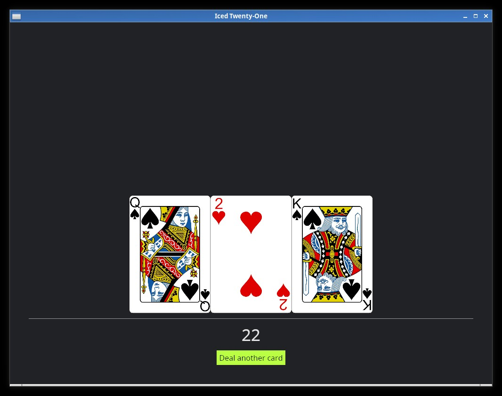
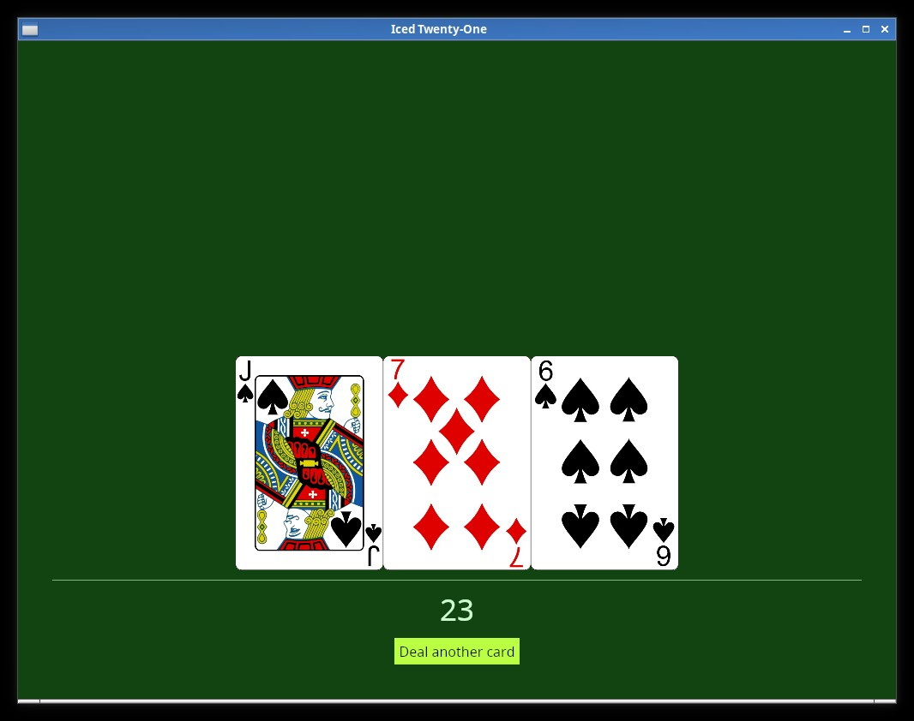

# Iced Dark and Custom themes

Do you dislike white backgrounds like me? If you do, you're lucky, Iced has a built-in Dark theme, the Application trait has an optional `theme()` function that we can use to specify which Theme variant we want to use, let's try it:

```rust
fn theme(&self) -> Self::Theme {
    Theme::Dark
}
```

If you run the app now, you'll see that the dark theme is being used (together with our custom button style).



But what if we want to customize things further? As was the case with the button, you can see in the [Iced docs for iced::Theme](https://docs.rs/iced/0.10.0/iced/enum.Theme.html) that it also has a Custom variant, let's use that, for this we change our `theme()` function like this:

```rust
fn theme(&self) -> Self::Theme {
    Theme::Custom(Box::new(
        iced::theme::Custom::new(
            iced::theme::Palette {
                background: color!(0x114411),
                text: color!(0xCCFFCC),
                primary: color!(0xffffff),
                success: color!(0xffffff),
                danger: color!(0xCC0000),
            }
        )
    ))
}
```



You'll see now that the colors have changed. Here there's one very interesting thing to notice, try changing the `text` color on the pallete to black (0x000000) did you see something strange in the color of our hand value? Iced makes sure that the text is readable, so it won't respect the value we set there if it makes the text impossible to read (which does't happen with the `Rule` widget, you may have noticed that it did change to black).

Things like the "danger" color are used in some widget's own styles, if for example you try to use the `Button::Destructive` Style variant right now:

```rust
button(text("Deal another card")).on_press(Message::DealCard).style(Button::Destructive)
```

You'll see that our danger color will be used.
