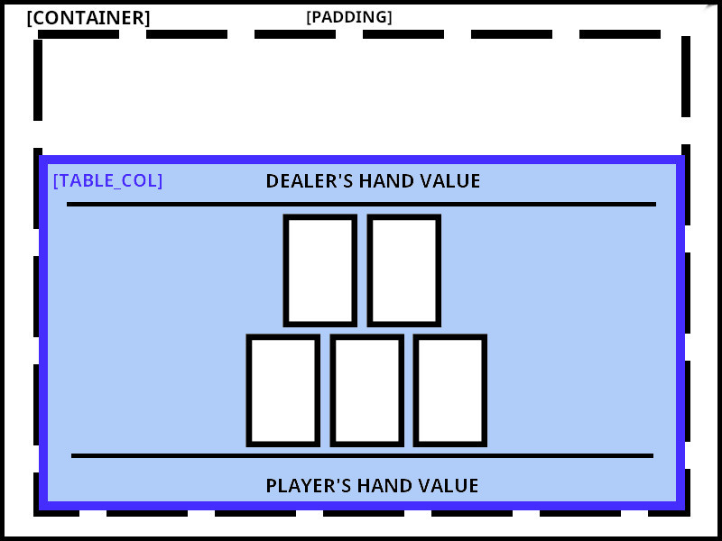
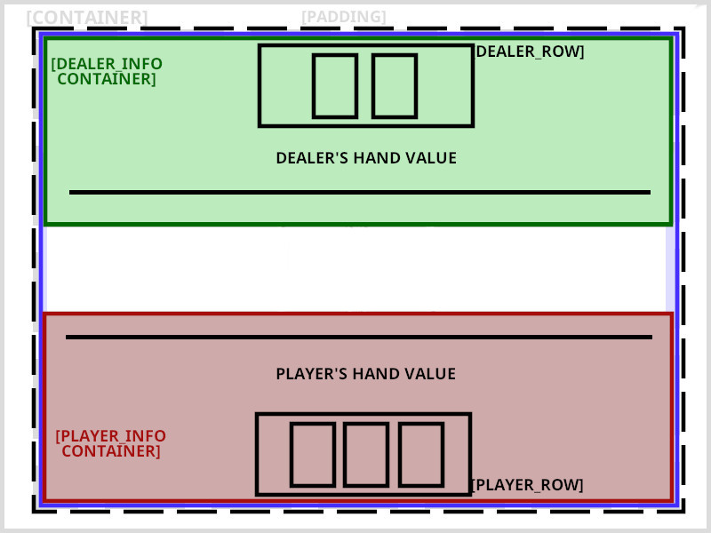

# Improving the layout further

This is starting to look like the actual game should, but the layout could look better don't you think? There's no reason for both rands to be so glued together and have all that space on the top.

This is how our layout is structured now:



Having all in the bottom was ok when we had only the player's hand, but now the dealer's hand is also inside the "table_col", it would be better to have it on top instead.

To do this, we'll have to separate our current *table_col* in two, a "*dealer_info*" container and a "*player_info*" one, one aligned to the top (with `align_y(Vertical::Top`) and the other to the bottom (with `.align_y(Vertical::Bottom)`). Inside each of these container we will have our column, with the hand value, rule and `Row` of cards, similar to what we have now:



For clarity I ommited the `Column` inside each container, since it's only there to stack the elements on top of each other.

Since there will be a `Column` right there inside the `Container` you may wonder why do we need to have it wrapped inside a `Container` at all. Well, these align functions are only present in the `Container`, so it's common to wrap things inside one to decorate them.
<br><br>

This is our updated view with these changes:

```rust
fn view(&self) -> Element<Message, iced::Renderer<theme::TwentyOneTheme>> {

    let mut dealer_row = Row::new().spacing(10);
    for card in &self.dealer_hand.cards {
        dealer_row = dealer_row.push(image(String::from("img/") + &card.get_id() + ".png").height(Length::Fixed(200.)));
    }

    let dealer_info = container(
        col![
            dealer_row,
            text(self.dealer_hand.value().to_string()).size(35),
            Rule::horizontal(4.),
        ].width(Length::Fill).align_items(iced::Alignment::Center).spacing(20)
    ).height(Length::Fill).align_y(Vertical::Top);

    let mut player_row = Row::new().spacing(10);
    for card in &self.player_hand.cards {
        player_row = player_row.push(image(String::from("img/") + &card.get_id() + ".png").height(Length::Fixed(200.)));
    }
    let player_info = container(
        col![
            Rule::horizontal(4.),
            text(self.player_hand.value().to_string()).size(35),
            player_row,
            button(text("Deal another card")).on_press(Message::DealCard),
        ].width(Length::Fill).align_items(iced::Alignment::Center).spacing(20)
    ).height(Length::Fill).align_y(Vertical::Bottom);

    let table_col = col![
        dealer_info,
        player_info,
    ].align_items(iced::Alignment::Center).spacing(10);

    container(table_col)
        .width(Length::Fill)
        .height(Length::Fill)
        .center_y()
        .padding(40)
        .into()
}
```

Since we are at it, I added a bit of spacing (`.spacing(10)`) between each card, as you may have noticed.


