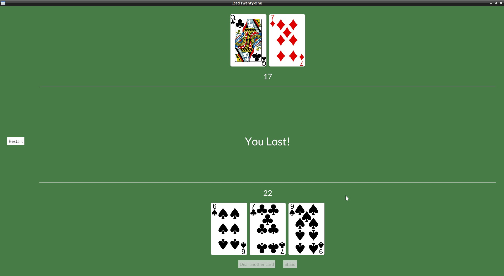

# Restart message

You probably are getting used to it by now, we add the new Message:

```rust
#[derive(Debug, Clone, Copy)]
enum Message {
    Start,
    DealCard,
    Stand,
    DealerDraw(Instant),
    Restart,
}
```

Set the button `on_press()` to generate our Message:

```rust
        let menu_col = col![
            container(
                button(text("Restart")).on_press(Message::Restart),
```

And to restart, we simply set our state to how it was in the beginning when we receive the `Message::Restart`:

```rust
} Message::Restart => {
    self.deck = Deck::new();
    self.deck.shuffle();
    self.player_hand = Hand::new();
    self.dealer_hand = Hand::new();
    self.player_hand.push(self.deck.deal_card().unwrap());
    self.player_hand.push(self.deck.deal_card().unwrap());
    self.dealer_hand.push(self.deck.deal_card().unwrap());
    self.dealer_hand.push(self.deck.deal_card().unwrap());
    self.game_stage = GameStage::Init;
}
```


