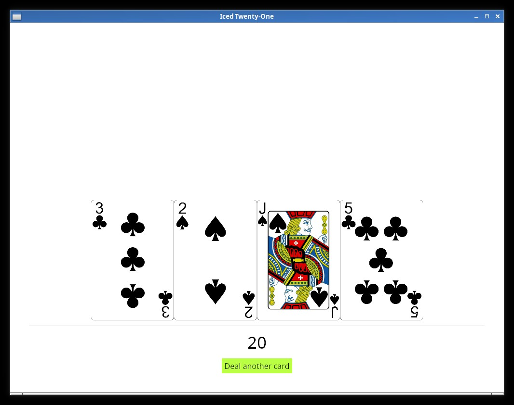

# Styling one widget

The visual is still a bit too generic, in most iced apps it will be a nice idea to implement a custom theme instead of using the default as we are right now, this might be a good chance to do it.

#### Important:
Iced themes are used to change colors, borders and such things, but **not** layout related stuff (padding, spacing, alignment, etc.).

But first let's see how we can style one individual widget, if you head on to [Iced's docs](https://docs.rs/iced_native/0.10.3/iced_native/theme/enum.Button.html), you'll see that the button widget theme has a few different pre-defined styles, let's try one of them, first we need to remember to import the Button theme:

```rust
use iced::theme::Button;
```

And we set the style by calling the `.style()` function in our Button like so:

```rust
button(text("Deal another card")).on_press(Message::DealCard).style(Button::Destructive)
```

Did you see the difference? You can try the other styles and see how they look.

-----------
But what if we want to define one style ourselves? You may have noticed that the Enum with the Button's styles has a `Custom` variant that takes a `Box` with a Stylesheet inside, if you click on the Stylesheet link in the docs page you'll see that traits' required methods, it's this that we need to implement, so let's do it:

```rust
#[derive(Default)]
struct TwentyOneButtonStyle;

impl iced::widget::button::StyleSheet for TwentyOneButtonStyle {
    type Style = iced::Theme;

    fn active(&self, _style: &Self::Style) -> button::Appearance {
        button::Appearance {
            background: Some(iced::Background::Color(color!(0xBBFF44))),
            text_color: Color::BLACK,
            ..Default::default()
        }
    }
    fn hovered(&self, _style: &Self::Style) -> button::Appearance {
        button::Appearance {
            background: Some(iced::Background::Color(color!(0x559911))),
            text_color: Color::WHITE,
            ..Default::default()
        }
    }
    fn pressed(&self, _style: &Self::Style) -> button::Appearance {
        self.hovered(_style)
    }
}
```

And now we can put it in a box and pass it to our button using the `Custom` variant of the style enum:

```rust
button(text("Deal another card")).on_press(Message::DealCard).style(Button::Custom( Box::new(TwentyOneButtonStyle)))
```



And now we have our custom Style being used. It might be a good time to play around with the different properties you can customize in the [Appearance](https://docs.rs/iced_native/0.10.3/iced_native/widget/button/struct.Appearance.html) Struct.

Here we tried with a Button, but most of the other widgets have a Custom variant in their Style enum as well, and this is a quick way you can customize things.
